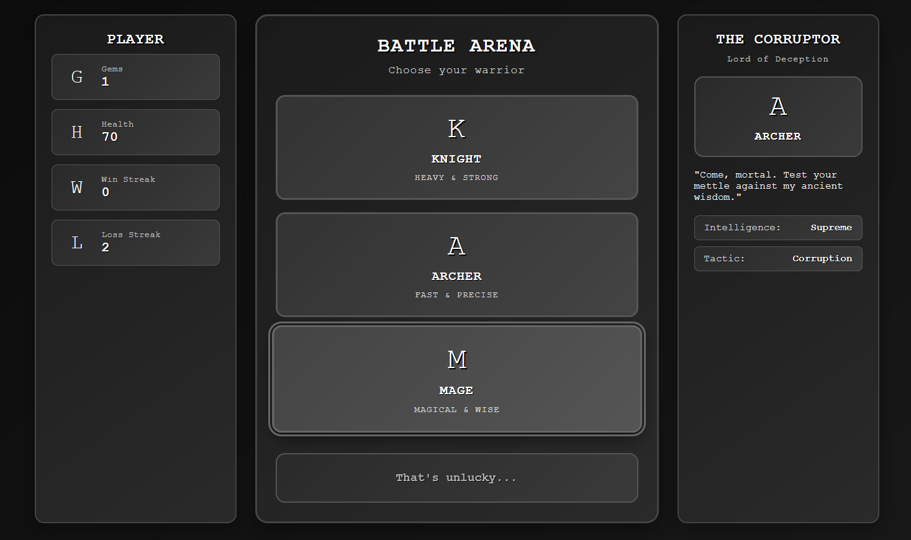

# Fantasy Rock Paper Scissors

A simple Rock Paper Scissors game with a fantasy twist and an AI opponent that learns from your moves.
One of my first projects while learning programming.

---

## Demo

---

## How to Play

### Console Version

1. Go to the `console-version/` folder
2. Run `python CorruptorGame.py` in your terminal

### Web Version (Flask)

1. Go to the `web-version/` folder
2. Install the requirements:  
   `pip install -r requirements.txt`
3. Run the app:
   `python app.py`
4. Open the link shown in your terminal (usually http://127.0.0.1:5000/) in your browser

## Features

- **Adaptive AI**: The Corruptor learns from your last 3 moves and adjusts its strategy
- **Pattern Detection**: If you make the same move 3 times in a row, the AI will counter it
- **Fantasy Theme**: Play as Knight, Archer, or Mage instead of traditional Rock, Paper, Scissors

## Why I made this

To practice Python basics, conditionals, and a bit of web development while having fun.
